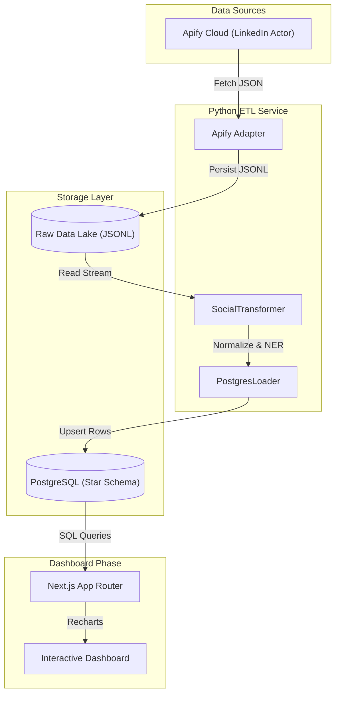
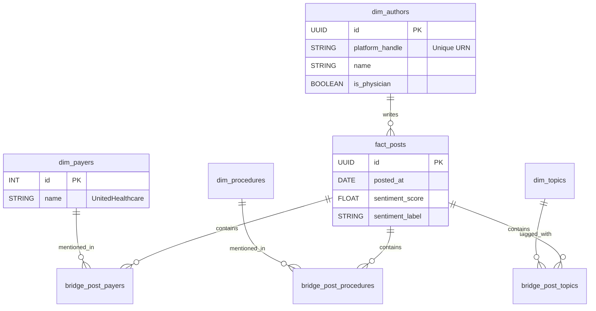

# Social-listening-Dashboard
Technical Design Document: Interventional Pain Social Listening Engine
# Technical Design Document: Interventional Pain Social Listening Engine

# 1. System Overview

### Business Objective
To empower Interventional Pain practices and RCM leaders with actionable intelligence by monitoring U.S.-centric conversations on prior authorization, billing denials (e.g., UHC, Aetna), procedure trends (SCS, Intracept), and policy shifts (WISeR, LCDs). The system transforms fragmented social chatter into a structured operational dashboard for weekly surveillance and strategic decision support.

### Core Technology Stack
| Component | Technology | Role |
| :--- | :--- | :--- |
| **ETL Engine** | Python 3.11 | Orchestration, customized extraction, and NLP transformation logic. |
| **Data Warehouse** | PostgreSQL 16 | Relational storage using a Star Schema for high-performance analytics. |
| **Frontend/UI** | Next.js 14 | Interactive Dashboard (App Router) with React Server Components. |
| **Orchestration** | Docker Compose | Containerized deployment ensuring consistent environments. |

### High-Level Architecture


---

# 2. ETL Architecture (Extract-Transform-Load)

## Phase 1: Extraction Service (`src/etl/extract/`)
**Goal**: Reliable, scheduled ingestion of raw data from LinkedIn via Apify.

### 2.1. The Apify Adapter
*   **Class**: `ApifyLinkedinExtractor`
*   **Source**: `curious_coder/linkedin-post-search-scraper` (Actor).
*   **Configuration Parameters**:
    *   `keywords`: List[str] (Loaded from `config/topics.yaml`)
    *   `date_posted`: "past-week"
    *   `sort`: "date"
    *   `limit`: 200 (Per keyword cap to manage costs)
*   **Execution Logic**:
    1.  **Iterate**: Loop through topics defined in `topics.yaml` (e.g., ["Intracept", "Prior Auth"]).
    2.  **Request**: Send payload to Apify Client.
    3.  **Validation**: Check `run.status == "SUCCEEDED"`.
    4.  **Pagination**: Fetch results using `client.dataset(id).list_items()`.

### 2.2. Raw Persistence Strategy (The "Lake")
We save **Raw Immutable Data** to allow historical re-processing.
*   **Path Format**: `data/raw/linkedin/{YYYY}/{MM}/{DD}/{topic}_{timestamp}.jsonl`
*   **File Format**: JSON Lines.
*   **Fields Conserved**: All original fields from Apify + `meta_extracted_at`.

---

## Phase 2: Transformation Service (`src/etl/transform/`)
**Goal**: Convert unstructured JSON into Typed Domain Objects.

### 2.3. The Transformer Logic
*   **Class**: `SocialPostTransformer`
*   **Input**: Raw JSON Dict.
*   **Output**: `TransformedPost` (Pydantic Model).

#### A. Data Normalization
*   **Timestamp**: Convert relative ("2d ago") or varied formats to **UTC ISO 8601**.
*   **Text Cleaning**:
    *   Strip `#hashtags` from end of post (optional).
    *   Remove `https://t.co` shortened links.
    *   Standardize whitespace.

#### B. Entity Extraction (NER)
We use a **Rule-Based NER Engine** (Regex) for high precision on medical terms.
*   **Payer Dictionary**:
    *   `UHC`: `r"\b(UHC|United|UnitedHealthcare|Optum)\b"`
    *   `Aetna`: `r"\b(Aetna|CVS Health)\b"`
    *   `Cigna`: `r"\b(Cigna|Evernorth)\b"`
    *   `Medicare`: `r"\b(Medicare|CMS|Noridian|Novitas)\b"`
*   **Procedure Dictionary**:
    *   `Intracept`: `r"\b(Intracept|Basivertebral|BVN)\b"`
    *   `SCS`: `r"\b(SCS|Spinal Cord Stim|Nevro|Abbott|Boston Scientific)\b"`

#### C. Sentiment Engine
*   **Algorithm**: `TextBlob` (Phase 1) -> `VADER` (Phase 2).
*   **Scoring**: Returns float `[-1.0, 1.0]`.
*   **Labeling Thresholds**:
    *   **Positive**: Score > 0.15
    *   **Negative**: Score < -0.15
    *   **Neutral**: Between -0.15 and 0.15

#### D. Influence Scoring
*   **Logic**:
    `impact_score = (likes * 1.0) + (comments * 2.0) + (reposts * 3.0)`
*   **Physician Flag**:
    If `author_title` matches `r"(MD|DO|Dr\.|Physician|Anesthesiologist|Pain Mgmt)"`.

---

## Phase 3: Loading Service (`src/etl/load/`)
**Goal**: Idempotent upsert into the Analytics Data Warehouse.

### 2.4. Target Schema (PostgreSQL)

#### Entity Relationship Diagram (ERD)


#### SQL DDL Specifications

**`dim_authors`**
```sql
CREATE TABLE dim_authors (
    author_id UUID PRIMARY KEY DEFAULT gen_random_uuid(),
    platform_id VARCHAR(255) UNIQUE NOT NULL, -- LinkedIn URN
    name VARCHAR(255),
    headline TEXT,
    is_physician BOOLEAN DEFAULT FALSE,
    profile_url TEXT,
    first_seen_at TIMESTAMP DEFAULT NOW()
);
```

**`dim_payers`** (Static Data)
```sql
CREATE TABLE dim_payers (
    payer_id SERIAL PRIMARY KEY,
    name VARCHAR(50) UNIQUE, -- "UnitedHealthcare"
    category VARCHAR(50) -- "Commercial", "Govt"
);
```

**`fact_posts`**
```sql
CREATE TABLE fact_posts (
    post_id UUID PRIMARY KEY DEFAULT gen_random_uuid(),
    platform_post_id VARCHAR(255) UNIQUE NOT NULL,
    author_id UUID REFERENCES dim_authors(author_id),
    posted_at TIMESTAMP WITH TIME ZONE NOT NULL,
    content TEXT,
    
    -- Metrics
    sentiment_score FLOAT,
    sentiment_label VARCHAR(20),
    likes_count INT DEFAULT 0,
    comments_count INT DEFAULT 0,
    impact_score INT DEFAULT 0,
    
    source_processed_at TIMESTAMP DEFAULT NOW()
);
-- Indexes for Dashboard Speed
CREATE INDEX idx_posts_date ON fact_posts (posted_at DESC);
CREATE INDEX idx_posts_sentiment ON fact_posts (sentiment_label);
```

**`bridge_post_payers`**
```sql
CREATE TABLE bridge_post_payers (
    post_id UUID REFERENCES fact_posts(post_id) ON DELETE CASCADE,
    payer_id INT REFERENCES dim_payers(payer_id),
    PRIMARY KEY (post_id, payer_id)
);
```

---

# 3. Dashboard Application Design (`src/dashboard/`)
**Goal**: "Executive Command Center" UI.

### 3.1. Frontend Architecture
*   **Framework**: Next.js 14 (App Router).
*   **Rendering**: Server Components (RSC) for initial data fetch, Client Components for charts.
*   **State Management**: `Zustand` store for Global Filter State.
    *   `useFilterStore`: `{ dateRange, selectedPayers[], selectedTopics[] }`

### 3.2. Visual Component Specifications

#### A. The "Payer Heatmap"
*   **Component**: `PayerVolumeChart.tsx`
*   **Library**: `Recharts.BarChart`
*   **SQL Query**:
    ```sql
    SELECT p.name, COUNT(*) as volume
    FROM fact_posts f
    JOIN bridge_post_payers b ON f.post_id = b.post_id
    JOIN dim_payers p ON b.payer_id = p.payer_id
    WHERE f.posted_at > NOW() - INTERVAL '7 days'
    GROUP BY p.name;
    ```

#### B. The "Sentiment Stream"
*   **Component**: `SentimentTrendChart.tsx`
*   **Library**: `Recharts.AreaChart` (Stacked)
*   **Design**: X-Axis (Date), Y-Axis (% Contribution), Colors (Green/Grey/Red).

#### C. The "Spike Alert" Module
*   **Component**: `AlertFeed.tsx`
*   **Logic**:
    *   Calculate `Moving Average (7d)` for "Prior Auth".
    *   If `Current Day Vol` > `2.5 * MA`, trigger Alert Card.
    *   **UI**: Red bordered card: *"⚠ Unusual Spike in 'Prior Auth' detected today (+220%)."*

#### D. The "Voice of Reason" Table
*   **Component**: `InfluencerTable.tsx`
*   **Library**: `TanStack Table` (Headless) + Shadcn UI Table.
*   **Sort**: Default by `Impact Score` DESC.
*   **Columns**: [Author (Avatar+Name), Role, Sentiment (Badge), Top Mentioned Payer].

---

# 4. Deployment & DevOps
*   **Containerization**:
    *   `etl_service`: Python container running Cron scheduler.
    *   `db`: Postgres 16 Alpine.
    *   `dashboard`: Node.js 20 Alpine.
*   **Environment Variables**:
    *   `APIFY_TOKEN`: *******
    *   `POSTGRES_URL`: `postgresql://user:pass@db:5432/pain_intel`
